---
## Front matter
lang: ru-RU
title: Презентация по лабораторной работе №2
subtitle: ""
author:
  - Еюбоглу Тимур, Зиязетдинов Алмаз, Исаев Булат
institute:
  - Российский университет дружбы народов, Москва, Россия

## i18n babel
babel-lang: russian
babel-otherlangs: english

## Formatting pdf
toc: false
toc-title: Содержание
slide_level: 2
aspectratio: 169
section-titles: true
theme: metropolis
header-includes:
 - \metroset{progressbar=frametitle,sectionpage=progressbar,numbering=fraction}
 - '\makeatletter'
 - '\makeatother'
---

## Докладчик

  * Еюбоглу Тимур
  * 1032224357
  * уч. группа: НПИбд-01-22
  * Факультет физико-математических и естественных наук
  * Российский университет дружбы народов

## Цель лабораторной работы

Внешний злоумышленник проводит многоэтапную атаку на корпоративную инфраструктуру, начиная с эксплуатации уязвимостей на публичных сервисах.
Цель атаки — получение контроля над внутренними ресурсами, захват контроллера домена, хищение данных и дестабилизация работы компании.

# Выполнение лабораторной работы

## ViPNet IDS NS

{#fig:001}

## Вход в панель администратора

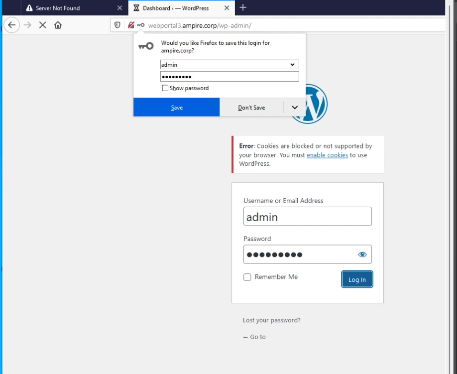{#fig:002}

## Отключение плагина в панели управления в WordPres

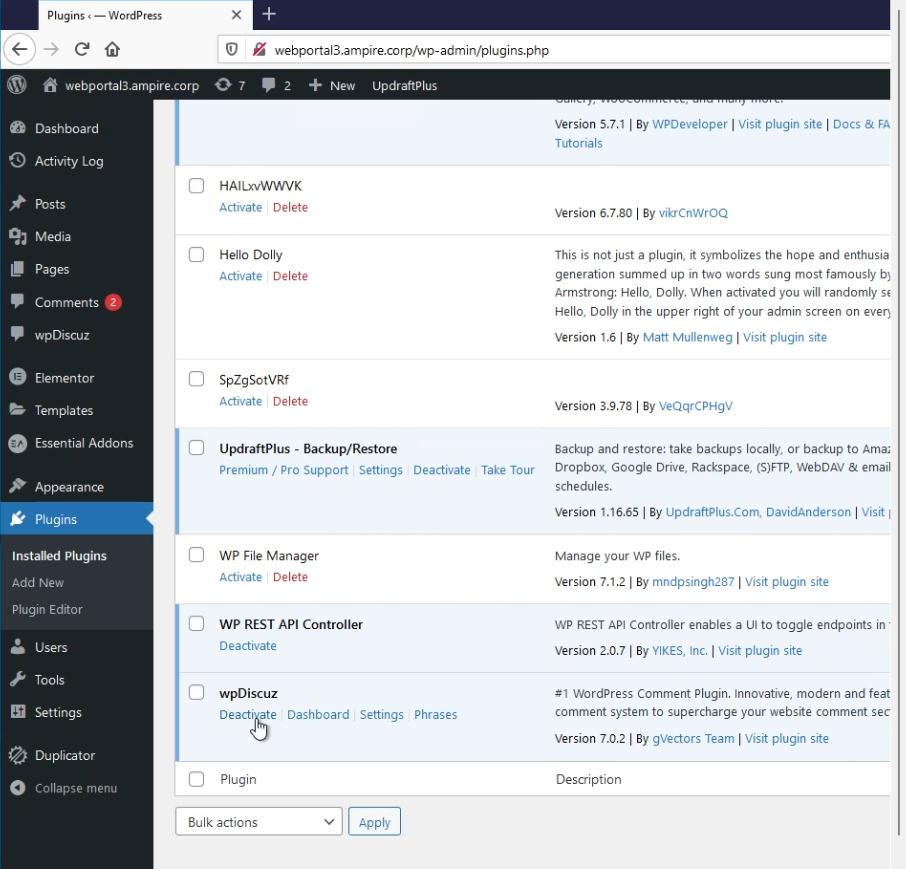{#fig:003}

## Страница сайта

{#fig:004}

## Cуществующие резервные копии UpdraftPlus

{#fig:005}

## Успешное выполнение восстановления 

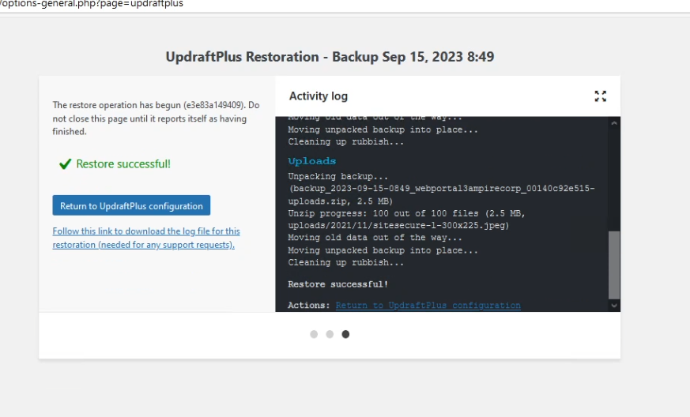{#fig:006}

## Отображение информации о TCP-соединениях

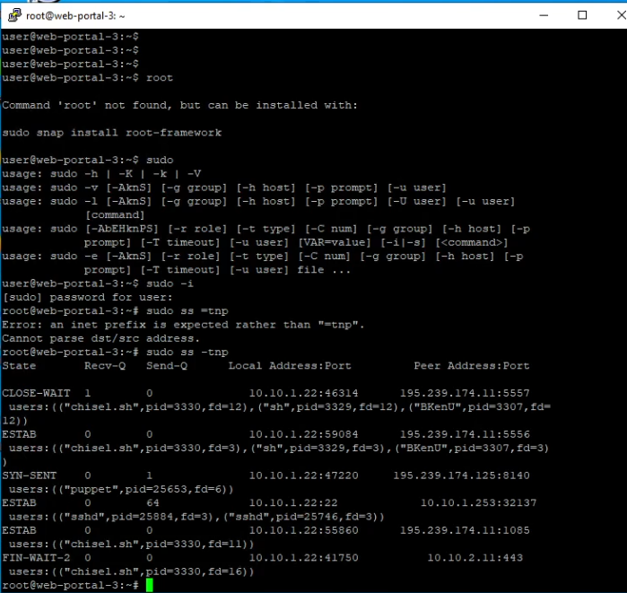{#fig:007}

## Процесс закрытия meterpreter-сессии

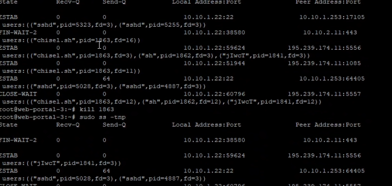{#fig:008}

## IP Address and Domain Restrictions.

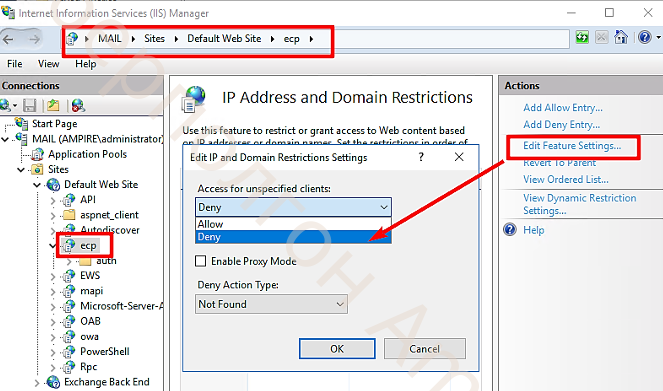{#fig:009}

## Завершение процессов.

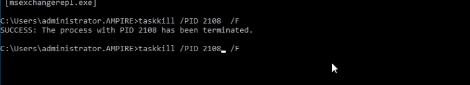{#fig:010}

## Удаление файла AM BACKDOOR.

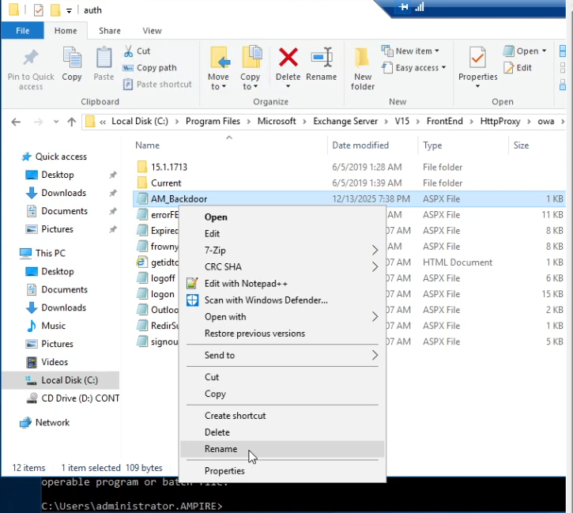{#fig:011}

## Восстановление пароля

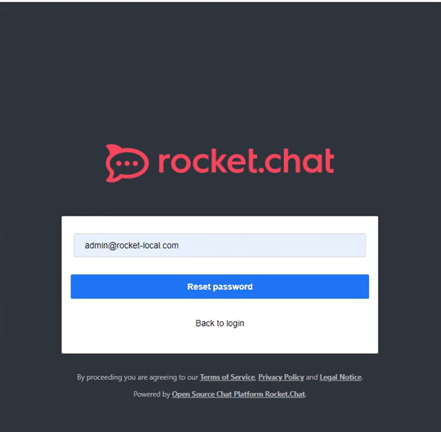{#fig:012}

## Ссылка для сброса пароля

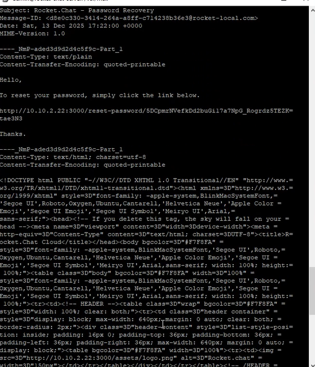{#fig:013}

## back_up коды для двух. ауентитификации

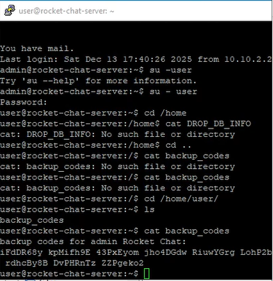{#fig:014}

## Настройка конфигурации БД

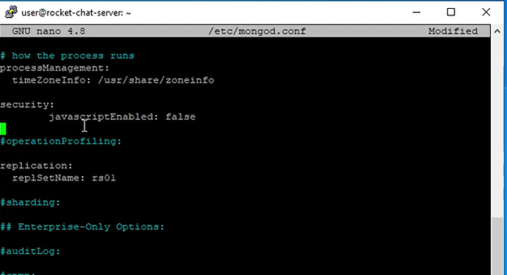{#fig:015}

## Удаление соединений

{#fig:016}

# Вывод

## Вывод

В ходе выполнения лабораторной работы были изучены и практически освоены методы обнаружения, анализа и устранения сложных многоэтапных кибератак на корпоративную инфраструктуру с использованием учебно-тренировочного комплекса Ampire.

Были исследованы три критические уязвимости в различных компонентах инфраструктуры: WpDiscuz, Rocket.Chat, Proxylogon.

# Список литературы. Библиография