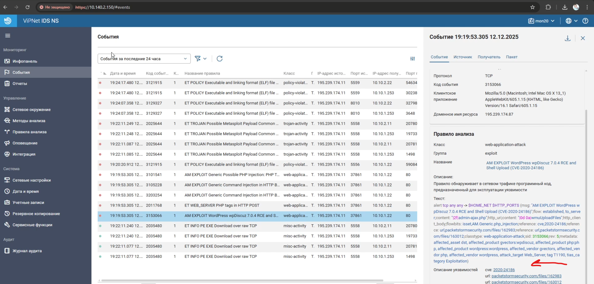
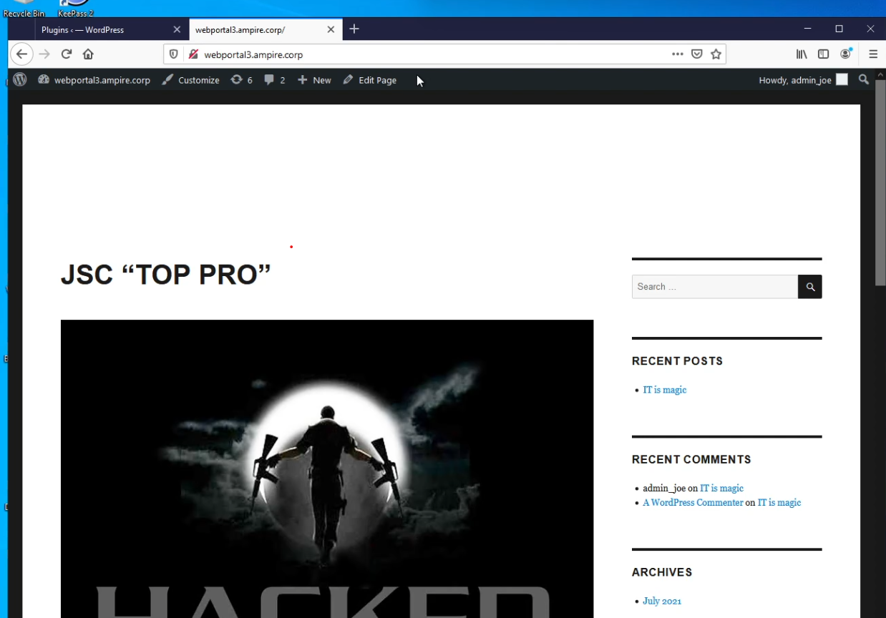
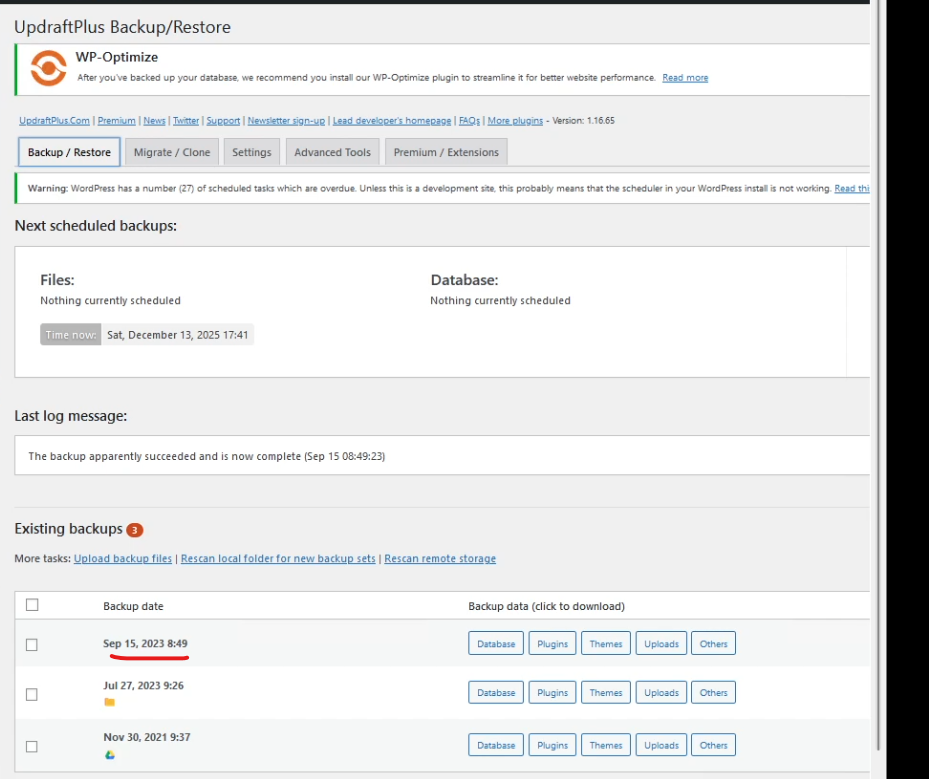
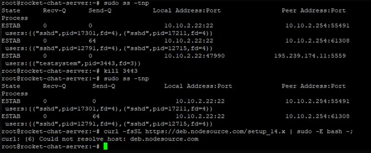

---
## Front matter
title: "Лабораторная работа №2"
subtitle: "Кибербезопасность предприятия"
author: "Еюбоглу Т, Зиязетдинов А, Исаев Б| НПИбд-01-22"

## Generic otions
lang: ru-RU
toc-title: "Содержание"

## Bibliography
bibliography: bib/cite.bib
csl: pandoc/csl/gost-r-7-0-5-2008-numeric.csl

## Pdf output format
toc: true # Table of contents
toc-depth: 2
lof: true # List of figures
fontsize: 12pt
linestretch: 1.5
papersize: a4
documentclass: scrreprt
## I18n polyglossia
polyglossia-lang:
  name: russian
  options:
	- spelling=modern
	- babelshorthands=true
polyglossia-otherlangs:
  name: english
## I18n babel
babel-lang: russian
babel-otherlangs: english
## Fonts
mainfont: PT Serif
romanfont: PT Serif
sansfont: PT Sans
monofont: PT Mono
mainfontoptions: Ligatures=TeX
romanfontoptions: Ligatures=TeX
sansfontoptions: Ligatures=TeX,Scale=MatchLowercase
monofontoptions: Scale=MatchLowercase,Scale=0.9
## Biblatex
biblatex: true
biblio-style: "gost-numeric"
biblatexoptions:
  - parentracker=true
  - backend=biber
  - hyperref=auto
  - language=auto
  - autolang=other*
  - citestyle=gost-numeric
## Pandoc-crossref LaTeX customization
figureTitle: "Рис."
tableTitle: "Таблица"
listingTitle: "Листинг"
lofTitle: "Список иллюстраций"
lolTitle: "Листинги"
## Misc options
indent: true
header-includes:
  - \usepackage{indentfirst}
  - \usepackage{float} # keep figures where there are in the text
  - \floatplacement{figure}{H} # keep figures where there are in the text
---

# Цель работы

Изучить сценарий атаки внешнего злоумышленника на корпоративную инфраструктуру с использованием уязвимостей в компонентах веб-серверов, почтовых систем и мессенджеров. Освоить методы обнаружения, анализа и устранения последствий компьютерных атак с использованием программного комплекса Ampire, включая выявление уязвимостей (CVE-2020-24186, CVE-2021-22911, CVE-2022-0847, CVE-2020-26855 и CVE-2021-27065), а также нейтрализацию их последствий.

# Теоретическое введение

Внешний злоумышленник проводит многоэтапную атаку на корпоративную инфраструктуру, начиная с эксплуатации уязвимостей на публичных сервисах (веб-сайт, почтовый сервер, мессенджер).
Цель атаки — получение контроля над внутренними ресурсами, захват контроллера домена, хищение данных и дестабилизация работы компании.
Для этого используются следующие уязвимости:

CVE-2020-24186 (WpDiscuz): удалённое выполнение кода (RCE) через загрузку PHP-файла в комментариях.

CVE-2021-22911 и CVE-2022-0847 (Rocket.Chat): NoSQL-инъекция и уязвимость Dirty Pipe для повышения привилегий.

CVE-2020-26855 и CVE-2021-27065 (Proxylogon): обход аутентификации в Exchange Server и запись файла в произвольную директорию.

Последствия атак включают: дефейс сайта, установку обратных оболочек (meterpreter), создание backdoor, шифрование файлов, добавление пользователей и др.

Для защиты применяются системы мониторинга (ViPNet IDS NS, Security Onion), анализ логов, обновление ПО, настройка политик безопасности.

# Выполнение лабораторной работы

### 2.1 Уязвимость CVE-2020-24186 в WpDiscuz

Условия эксплуатации:
Версия плагина WpDiscuz 7.0.2, доступ к веб-серверу WordPress.

Шаги атаки:

Нарушитель отправляет POST-запрос на /wp-admin/admin-ajax.php с загрузкой PHP-файла через поле комментариев.

Файл сохраняется на сервере и позволяет выполнить произвольный код.

Обнаружение:

В логах Apache (/var/log/apache2/access.log) появляются запросы к admin-ajax.php с загрузкой файлов.

В журнале активности WordPress фиксируется несанкционированное действие.

Сенсоры ViPNet IDS NS и Security Onion детектируют аномальные запросы (например, ET WEB_SERVER PHP tags in HTTP POST). (рис. [-@fig:001])

{#fig:001}

Устранение уязвимости:

Отключение плагина:
В панели управления WordPress → Plugins → Deactivate (или Delete) для WpDiscuz. (рис. [-@fig:002]) (рис. [-@fig:003])

{#fig:002} 

{#fig:003}

Обновление плагина:
Загружена версия 7.0.5 (или выше) через раздел Plugins → Add New → Upload Plugin.

Нейтрализация последствий:

Дефейс сайта: восстановление из резервной копии через плагин UpdraftPlus. (рис. [-@fig:004]) (рис. [-@fig:005]) (рис. [-@fig:006]) (рис. [-@fig:007]) (рис. [-@fig:008])

{#fig:004}

{#fig:005}

{#fig:006}

Meterpreter-сессия: завершение процесса Apache, связанного с вредоносным сокетом (команда kill <PID>).

{#fig:007}

{#fig:008}

Caidao PHP backdoor: удаление файла caidao.php из директории /var/www/html/wordpress/.

### 2.2 Proxylogon (CVE 2021-26855 (SSRF))

CVE-2021-26855, также известная как Proxylogon, представляет собой уязвимость типа Server-Side Request Forgery (SSRF) в Microsoft Exchange Server. Данная уязвимость позволяет злоумышленнику обходить аутентификацию и выполнять запросы от имени сервера к внутренним ресурсам, что в итоге приводит к получению несанкционированного доступа к почтовым ящикам и выполнению произвольного кода.

Условия эксплуатации:

Наличие доступа к веб-интерфейсу Exchange (ECP) по адресу https://<target>/ecp.

Знание действительного email-адреса пользователя на атакуемом сервере.

Уязвимые версии Exchange Server (до версии 15.01.2106.013).

Шаги атаки:

Обход аутентификации через SSRF:
Злоумышленник отправляет специально сформированный запрос к конечной точке /autodiscover/autodiscover.xml, используя поддельный заголовок X-BEResource, который указывает на внутренний URL сервера. Это позволяет получить LegacyDN целевого пользователя.

Получение SID пользователя:
Используя полученный LegacyDN, атакующий отправляет POST-запрос к /ecp/<случайные_символы>.js, что приводит к ошибке доступа, в ответе которой содержится SID (Security Identifier) пользователя.

Авторизация в системе:
С помощью полученного SID злоумышленник отправляет запрос на авторизацию в Outlook, получая в ответ cookies (ASP.NET_SessionID и msExchEcpCanary), необходимые для дальнейших действий.

Использование CVE-2021-27065:
После успешной авторизации атакующий может изменить параметры виртуальной директории OAB (Offline Address Book) в панели управления Exchange, что позволяет записать вредоносный файл (например, веб-шелл) в произвольную директорию сервера.

Устранение уязвимости:

Во время эксплуатации уязвимости Proxylogon злоумышленник выполняет GET- и POST-запросы к директории /ecp на сервере Exchange. Для предотвращения эксплуатации уязвимости достаточно ограничить доступ к этой директории. Ниже приведены рекомендации по устранению уязвимости:

Открытие Internet Information Services (IIS) Manager:
Нажмите сочетание клавиш Win + R, в появившемся окне введите inetmgr и нажмите Enter.

Настройка ограничений доступа:
В открывшемся окне IIS Manager перейдите во вкладку:
MAIL → Sites → Default Web Site → ecp.
Выберите пункт IP Address and Domain Restrictions. (рис. [-@fig:009])

{#fig:009}

Обнаружение и устранение полезной нагрузки China Chopper и Meterpreter Сессии

Для устранения полезной нагрузки «meterpreter-сессия» необходимо: 
1. Выполнить команду netstat -b -o для обнаружения активных 
соединений. 
2. С помощью команды taskkill /PID <PID> /F завершить процессы, 
устанавливающие соединение с хостом нарушителя. (рис. [-@fig:010])

{#fig:010}

Устранение полезной нагрузки "Web-shell China Chopper"

Для нейтрализации данного последствия атаки необходимо выполнить следующие действия:

Удаление файла веб-оболочки:

Завершение вредоносных сетевых соединений:
Обнаружить и принудительно завершить все установленные злоумышленником соединения между скомпрометированным сервером и внешним хостом.
Подробная процедура описана в Подразделе 4.1 (методы завершения meterpreter-сессий).

Примечание:
Оба шага являются обязательными для полной нейтрализации угрозы. Удаление файла предотвращает повторный доступ, а завершение соединений останавливает активное взаимодействие злоумышленника с системой. (рис. [-@fig:011])

{#fig:011}

Закрытие уязвимостей в Rocket Chat
Для восстановления доступа к аккаунту администратора необходимо
сбросить пароль. Письмо с инструкциями для сброса пароля
можно прочитать при помощи утилиты mail (переключившись на учетную
запись admin), либо при помощи текстового редактора, прочитав файл
/var/mail/admin (рис. [-@fig:012]) (рис. [-@fig:013]) (рис. [-@fig:014]):

{#fig:012}

{#fig:013}

{#fig:014}

Необходимо скопировать ссылку из письма. Нужно обратить внимание, что в терминале при переносе строки
используется знак «=», его следует игнорировать.
После этого необходимо ввести новый пароль. Для учетной записи
администратора Rocket Chat настроена двухфакторная аутентификация при
помощи TOTP (Time-based one-time password). Для генерации
одноразового пароля необходимо воспользоваться программой KeePass,
доступной на машине администрирования (приложение А, стр. 30).

Так как вторая NoSQL-инъекция для повышения привилегий использует
высокоуровневый оператор БД $where, временной, смягчающей мерой, может
стать отключение выполнения JavaScript на стороне сервера базы данных.
Для этого необходимо отредактировать файл конфигурации БД
/etc/mongod.conf, добавив строчку javascriptEnabled: false (рис. [-@fig:015]):

{#fig:015}

Удаление соединений. (рис. [-@fig:016]):

{#fig:016}

# Вывод

В ходе выполнения лабораторной работы были изучены и практически освоены методы обнаружения, анализа и устранения сложных многоэтапных кибератак на корпоративную инфраструктуру с использованием учебно-тренировочного комплекса Ampire.

Были исследованы три критические уязвимости в различных компонентах инфраструктуры:

WpDiscuz (CVE-2020-24186) – уязвимость удалённого выполнения кода в плагине WordPress, позволяющая загружать и выполнять произвольные PHP-файлы через функционал комментариев.

Rocket.Chat (CVE-2021-22911, CVE-2022-0847) – комбинация NoSQL-инъекции и уязвимости Dirty Pipe в ядре Linux, приводящая к повышению привилегий и полному компрометированию системы.

Proxylogon (CVE-2021-26855, CVE-2021-27065) – SSRF-уязвимость в Microsoft Exchange Server, позволяющая обходить аутентификацию и загружать веб-шеллы на сервер.

# Список литературы