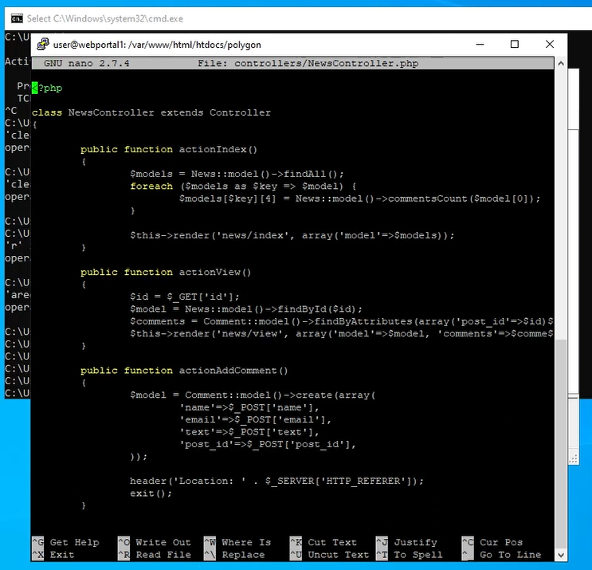
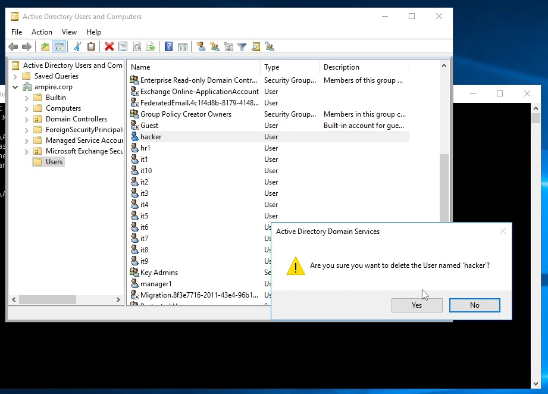

---
## Front matter
lang: ru-RU
title: Презентация по лабораторной работе №3
subtitle: ""
author:
  - Еюбоглу Тимур, Зиязетдинов Алмаз, Исаев Булат
institute:
  - Российский университет дружбы народов, Москва, Россия

## i18n babel
babel-lang: russian
babel-otherlangs: english

## Formatting pdf
toc: false
toc-title: Содержание
slide_level: 2
aspectratio: 169
section-titles: true
theme: metropolis
header-includes:
 - \metroset{progressbar=frametitle,sectionpage=progressbar,numbering=fraction}
 - '\makeatletter'
 - '\makeatother'
---

## Докладчик

  * Еюбоглу Тимур
  * 1032224357
  * уч. группа: НПИбд-01-22
  * Факультет физико-математических и естественных наук
  * Российский университет дружбы народов

## Цель лабораторной работы

Изучить сценарий атаки внешнего злоумышленника на контроллер домена предприятия с целью получения доступа к внутренним ресурсам компании. Освоить методы обнаружения, анализа и устранения последствий компьютерных атак с использованием программного комплекса "Ampire", включая выявление уязвимостей, таких как SQL-инъекция, отключенная защита антивируса и слабые пароли, а также их последствия.

## Теоретические сведения

Внешний злоумышленник находит сайт компании в интернете и проводит атаку на него для получения доступа к внутренним ресурсам. Обнаружив уязвимости на внешнем периметре, закрепляется на сервере и проводит разведку сети для захвата контроллера домена. Нарушитель обладает средней квалификацией, умеет использовать инструменты для атак и техники постэксплуатации, а также имеет опыт фишинговых рассылок.

# Выполнение лабораторной работы

## 4.1 SQL-инъекция

{#fig:01}

## Параметры уязвимой функции

{#fig:02}

## Параметры уязвимой функции

{#fig:03}

## 4.2 Последствие Web portal meterpreter

{#fig:04}

## Завершение сессии с нарушителем

{#fig:05}

## 4.3 Отключенная защита антивируса

{#fig:06}

## Интерфейс Windows Defender

{#fig:07}

## Real-time Protection

{#fig:08}

## 4.4 Последствие Admin meterpreter

{#fig:09}

## 4.5 Слабый пароль учетной записи

{#fig:010}

## 4.6 Последствие AD User

{#fig:011}

# Вывод

В ходе лабораторной работы был изучен сценарий атаки на контроллер домена предприятия с использованием уязвимостей SQL-инъекции, отключенной антивирусной защиты и слабых паролей. Освоены методы детектирования атак с помощью ViPNet IDS NS, ViPNet TIAS и Security Onion, а также способы устранения последствий. Полученные навыки позволяют эффективно защищать корпоративные сети от внешних угроз средней сложности.

## Вывод

Отработали навыки проведения комплексной кибератаки в контролируемой среде, имитирующей реальную корпоративную сеть.