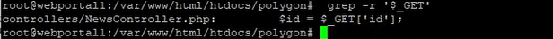
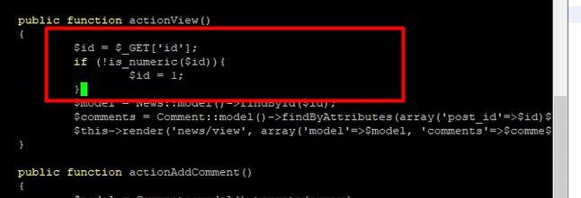
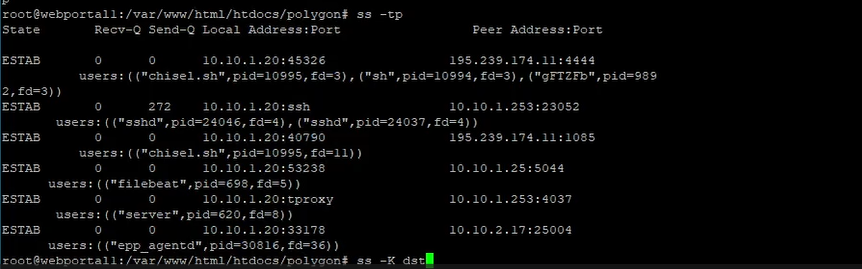
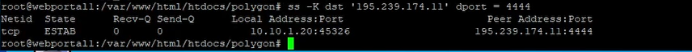
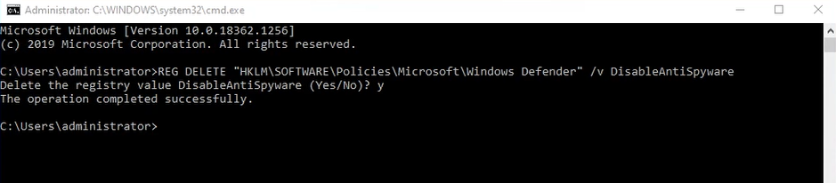
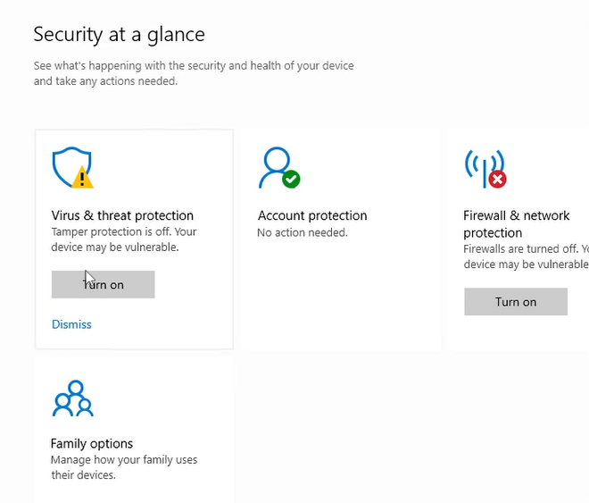
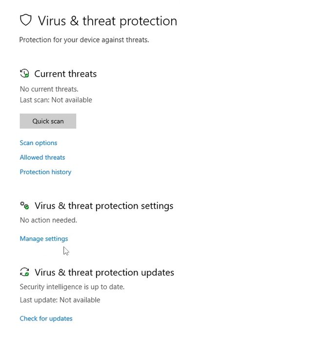
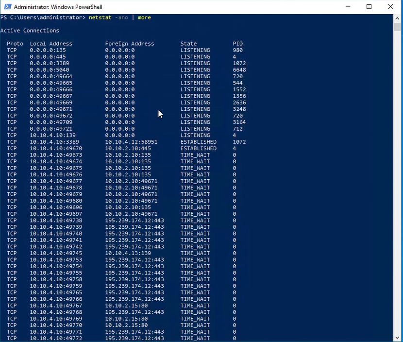
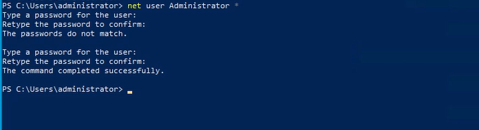

---
## Front matter
title: "Лабораторная работа №3"
subtitle: "Кибербезопасность предприятия"
author: "Еюбоглу Т, Зиязетдинов А, Исаев Б| НПИбд-01-22"

## Generic otions
lang: ru-RU
toc-title: "Содержание"

## Bibliography
bibliography: bib/cite.bib
csl: pandoc/csl/gost-r-7-0-5-2008-numeric.csl

## Pdf output format
toc: true # Table of contents
toc-depth: 2
lof: true # List of figures
lot: true # List of tables
fontsize: 12pt
linestretch: 1.5
papersize: a4
documentclass: scrreprt
## I18n polyglossia
polyglossia-lang:
  name: russian
  options:
  - spelling=modern
  - babelshorthands=true
polyglossia-otherlangs:
  name: english
## I18n babel
babel-lang: russian
babel-otherlangs: english
## Fonts
mainfont: IBM Plex Serif
romanfont: IBM Plex Serif
sansfont: IBM Plex Sans
monofont: IBM Plex Mono
mathfont: STIX Two Math
mainfontoptions: Ligatures=Common,Ligatures=TeX,Scale=0.94
romanfontoptions: Ligatures=Common,Ligatures=TeX,Scale=0.94
sansfontoptions: Ligatures=Common,Ligatures=TeX,Scale=MatchLowercase,Scale=0.94
monofontoptions: Scale=MatchLowercase,Scale=0.94,FakeStretch=0.9
mathfontoptions:
## Biblatex
biblatex: true
biblio-style: "gost-numeric"
biblatexoptions:
  - parentracker=true
  - backend=biber
  - hyperref=auto
  - language=auto
  - autolang=other*
  - citestyle=gost-numeric
## Pandoc-crossref LaTeX customization
figureTitle: "Рис."
tableTitle: "Таблица"
listingTitle: "Листинг"
lofTitle: "Список иллюстраций"
lotTitle: "Список таблиц"
lolTitle: "Листинги"
## Misc options
indent: true
header-includes:
  - \usepackage{indentfirst}
  - \usepackage{float} # keep figures where there are in the text
  - \floatplacement{figure}{H} # keep figures where there are in the text
---

# Цель работы

Изучить сценарий атаки внешнего злоумышленника на контроллер домена предприятия с целью получения доступа к внутренним ресурсам компании. Освоить методы обнаружения, анализа и устранения последствий компьютерных атак с использованием программного комплекса "Ampire", включая выявление уязвимостей, таких как SQL-инъекция, отключенная защита антивируса и слабые пароли, а также их последствия.

# Теоретическое введение

Внешний злоумышленник находит сайт компании в интернете и проводит атаку на него для получения доступа к внутренним ресурсам. Обнаружив уязвимости на внешнем периметре, закрепляется на сервере и проводит разведку сети для захвата контроллера домена. Нарушитель обладает средней квалификацией, умеет использовать инструменты для атак и техники постэксплуатации, а также имеет опыт фишинговых рассылок.

Для прохождения сценария потребуется exploitation уязвимостей, таких как SQL-инъекция, отключение антивирусной защиты, использование слабых паролей и получение доступа к Active Directory.

# Выполнение лабораторной работы

### 4.1 SQL-инъекция

В ходе лабораторной работы была исследована уязвимость SQL-инъекции на веб-сервере PHP (узел Web Server PHP, порт 80). Злоумышленник сканирует сеть 195.239.174.0/24, находит веб-сервер и использует утилиту sqlmap для обнаружения уязвимого параметра (id) в запросе GET. С помощью sqlmap генерируется и загружается вредоносный файл php reverse shell (shell.php), что позволяет выполнить код на сервере и установить meterpreter-сессию для закрепления.
Для детектирования использовались инструменты ViPNet IDS NS и Security Onion (Squert, Kibana), где фиксировались события сканирования на SQL-инъекции, использование Blind SQL-Injection и загрузка файла с выставлением прав на выполнение (chmod).
Устранение: В файле NewsController.php в функции actionView() добавлена проверка типа параметра $id с помощью is_numeric(). Если $id не является числом, запрос становится статичным. После изменений уязвимость устранена, повторное сканирование sqlmap не выявляет проблем. (рис. @fig:01).

{#fig:01}

Считывание параметра сайта происходит в функции actionView() в файле NewsController.php (Рисунок 2)

{#fig:02}

Для проверки типа $id используется функция is_numeric, которая возвращает True в случае, если $id – число, иначе – False. В случае успешной проверки параметр $id будет передаваться в запрос, иначе – запрос будет статичным и независимым от $id (Рисунок 3).

{#fig:03}

### 4.2 Последствие Web portal meterpreter

Нарушитель устанавливает shell сессию с веб-порталом PHP. Для обнаружения последствия необходимо проверить сокеты уязвимой машины при помощи утилиты ss с ключами –tp (Рисунок 4).

{#fig:04}

Для устранения необходимо воспользоваться командой ss (Рисунок 8) с правами привилегированного пользователя, используя ключ –K и соответствующий адрес, порт для завершения сессии с нарушителем: sudo ss -K dst HACKER_IP dport = HACKER_PORT

{#fig:05}

В результате выполнения команды сессия с нарушителем завершена, последствие Web portal meterpreter успешно устранено. 

### 4.3 Отключенная защита антивируса

На узле администратора выключена защита в реальном времени Windows Defender, что дает нарушителю возможность получить контроль над компьютером администратора при запуске им вредоносного скрипта diag.ps1

{#fig:06}

{#fig:07}

{#fig:08}

После удаления записи реестра и включения защиты антивирусной программы Microsoft Defender необходимо перезагрузить Windows. 

### 4.4 Последствие Admin meterpreter

Установленную сессию с нарушителем можно обнаружить при помощи утилиты netstat с ключами –ano

{#fig:09}

Для устранения необходимо завершить сессию с машиной нарушителя. Например, при помощи команды taskkill /f /pid <PID> 

### 4.5 Слабый пароль учетной записи

На узле MS Active Directory установлен слабый пароль к учетной записи администратора, что позволяет нарушителю перебирать пароль 

{#fig:010}

### 4.6 Последствие AD User

Добавление нового привилегированного пользователя можно отследить с помощью аудита событий входа в учетную запись Windows security, где появится событие с ID 4720. Необходимо перейти в Event Viewer и в Windows Logs – Security, затем применить фильтр на логи. Ниже показан лог, генерируемый при добавлении новог пользователя (Рисунок 16). 

{#fig:011}

В результате выполнения вышеупомянутых действий Киберполгон Ampire привилегированный пользователь удален, последствие AD User успешно устранено.

# Вывод

В ходе лабораторной работы был изучен сценарий атаки на контроллер домена предприятия с использованием уязвимостей SQL-инъекции, отключенной антивирусной защиты и слабых паролей. Освоены методы детектирования атак с помощью ViPNet IDS NS, ViPNet TIAS и Security Onion, а также способы устранения последствий. Полученные навыки позволяют эффективно защищать корпоративные сети от внешних угроз средней сложности.

# Список литературы{.unnumbered}

::: {#refs}
:::