---
## Front matter
title: "Лабораторная работа №4"
subtitle: "Кибербезопасность предприятия"
author: "Еюбоглу Т, Зиязетдинов А, Исаев Б| НПИбд-01-22"

## Generic otions
lang: ru-RU
toc-title: "Содержание"

## Bibliography
bibliography: bib/cite.bib
csl: pandoc/csl/gost-r-7-0-5-2008-numeric.csl

## Pdf output format
toc: true # Table of contents
toc-depth: 2
lof: true # List of figures
lot: true # List of tables
fontsize: 12pt
linestretch: 1.5
papersize: a4
documentclass: scrreprt
## I18n polyglossia
polyglossia-lang:
  name: russian
  options:
  - spelling=modern
  - babelshorthands=true
polyglossia-otherlangs:
  name: english
## I18n babel
babel-lang: russian
babel-otherlangs: english
## Fonts
mainfont: IBM Plex Serif
romanfont: IBM Plex Serif
sansfont: IBM Plex Sans
monofont: IBM Plex Mono
mathfont: STIX Two Math
mainfontoptions: Ligatures=Common,Ligatures=TeX,Scale=0.94
romanfontoptions: Ligatures=Common,Ligatures=TeX,Scale=0.94
sansfontoptions: Ligatures=Common,Ligatures=TeX,Scale=MatchLowercase,Scale=0.94
monofontoptions: Scale=MatchLowercase,Scale=0.94,FakeStretch=0.9
mathfontoptions:
## Biblatex
biblatex: true
biblio-style: "gost-numeric"
biblatexoptions:
  - parentracker=true
  - backend=biber
  - hyperref=auto
  - language=auto
  - autolang=other*
  - citestyle=gost-numeric
## Pandoc-crossref LaTeX customization
figureTitle: "Рис."
tableTitle: "Таблица"
listingTitle: "Листинг"
lofTitle: "Список иллюстраций"
lotTitle: "Список таблиц"
lolTitle: "Листинги"
## Misc options
indent: true
header-includes:
  - \usepackage{indentfirst}
  - \usepackage{float} # keep figures where there are in the text
  - \floatplacement{figure}{H} # keep figures where there are in the text
---

# Цель работы

Цель данной лабораторных работ — отработка навыков проведения комплексной кибератаки в контролируемой среде, имитирующей реальную корпоративную сеть.

# Теоретическое введение

Во внутреннем сегменте организации необходимо получить доступ к DNS-серверу и найти флаг в одной из DNS-записей.

Для прохождения данного сценария в первую очередь потребуется активная meterpreter-сессия с узлом в сегменте DMZ.

# Выполнение лабораторной работы

Перед началом атаки я провожу разведку путем сканирования сети. На основе исходных данных я определяю адрес подсети, в которой находится целевой сервер – 195.239.174.0/24. Для обнаружения уязвимых узлов я использую сканер nmap – это инструмент сканирования сетей, который позволяет настраивать сканирование с помощью передаваемых через командную строку флагов.

Применяемые мной флаги:
- -sV – проверяет открытые порты для определения информации о службе/версии;
- -sC – производит сканирование скриптами. (рис. @fig:001). 

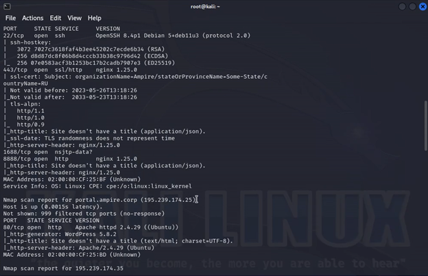{#fig:001}

В результате сканирования я обнаружил, что сервер с адресом 195.239.174.25 содержит открытый 80 порт (http), на котором располагается веб-портал portal.ampire.corp. Для перехода на сайт портала организации мне необходимо добавить статическую запись в файл /etc/hosts. (рис. @fig:002). 

{#fig:002}

При переходе по адресу http://portal.ampire.corp в браузере открывается сайт портала организации. В нижней части страницы портала я обнаруживаю информацию, что данный сайт создан с помощью CMS Wordpress. (рис. @fig:003).

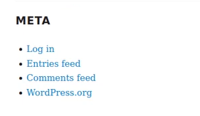{#fig:003}

Сайт работает на CMS Wordpress, поэтому для поиска возможных векторов атаки я провожу сканирование с помощью модуля Metasploit wordpress_scanner.

Metasploit Framework – это инструмент, содержащий множество модулей для исследования и эксплуатации уязвимостей. Я открываю фреймворк через командную строку с помощью команды msfconsole в терминале. (рис. @fig:004) (рис. @fig:005).

{#fig:004}

{#fig:005}

Для исследования CMS WordPress на уязвимости я выбираю подходящий модуль сканирования. Выполняю поиск нужного модуля с помощью команды: (рис. @fig:006)

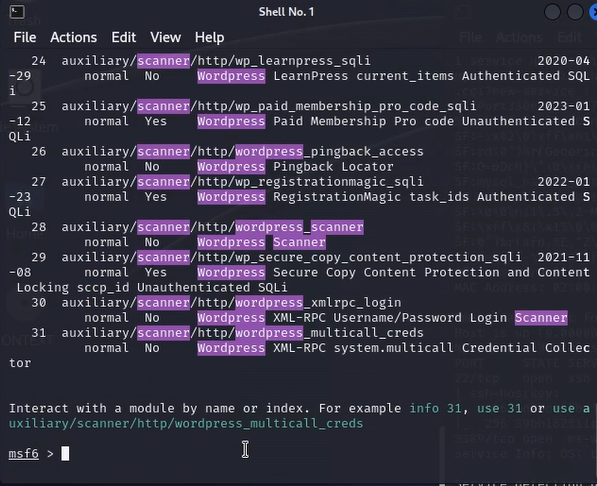{#fig:006}

Наиболее подходящим инструментом для моих задач является модуль 28 auxiliary/scanner/http/wordpress_scanner. Для выбора данного модуля я использую команду: use 28. 
Для правильной настройки модуля я отображаю настраиваемые параметры с помощью команды: options (рис. @fig:007)

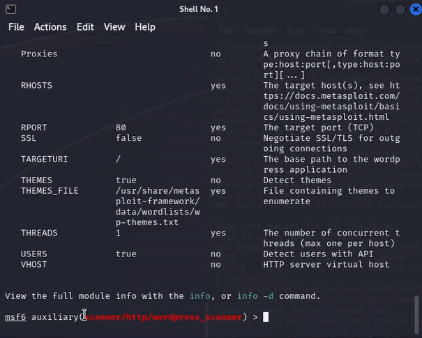{#fig:007}

Для настройки модуля сканирования я задаю параметр rhost, который определяет цель сканирования. В данном случае целью выступает portal.ampire.corp. Настройку произвожу с помощью команды: set rhost portal.ampire.corp. После настройки модуль запускается с помощью команды: run (рис. @fig:008)

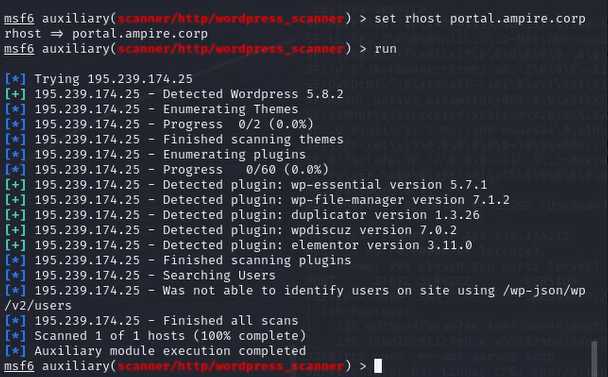{#fig:008}

Результатом сканирования является список используемых целевым сервисом плагинов (рис. @fig:009)

{#fig:009}

После сканирования я проверяю, какие из обнаруженных плагинов являются уязвимыми:

- **Wp essential** - является уязвимым и может быть эксплуатирован злоумышленником;
- **Wp-file-manager v7.1.2** - не является уязвимым после версии 6.9;
- **Duplicator** - является уязвимым и может быть эксплуатирован злоумышленником;
- **WpDiscuz** - содержит уязвимость, которая может привести к удаленному выполнению кода;
- **Elementor** - не является уязвимым, но дополнение Essential может быть использовано злоумышленником.

В данном сценарии для захвата сайта я могу использовать любой из плагинов: WpDiscuz, Duplicator или Essential. Варианты эксплуатации этих плагинов будут продемонстрированы далее.

### 2.1.1 Эксплуатация плагина WpDiscuz

Уязвимость данного плагина заключается в возможности загрузки произвольного файла на сервер с последующим удаленным выполнением кода (RCE). Плагин предназначен для разрешения пользователям прикреплять только изображения к комментариям, но уязвимые версии WpDiscuz не могут корректно проверить тип прикрепляемых файлов. Это позволяет загружать на сервер файлы любого типа, включая PHP-файлы.

Для эксплуатации данной уязвимости мне потребуется только адрес целевой машины и ссылка на любой пост с возможностью комментирования. IP-адрес целевой машины я уже получил на этапе сканирования, а адрес поста можно получить при просмотре записи после перехода по ссылке с главной страницы портала организации. (рис. @fig:010)

{#fig:010}

Найденный пост «IT is magic» от пользователя «admin_joe» имеет следующий адрес: /index.php/2021/07/26/hello-world/. Этот адрес будет использоваться при проведении атаки.

Для отмены выбора модуля мне необходимо набрать в командной строке команду `back`. Далее я осуществляю поиск нужного эксплойта для выбранного плагина с помощью команды: search wordpress exploit wp_wpdiscuz (рис. @fig:011)

{#fig:011}

В консоли Metasploit отображается единственный найденный модуль exploit unix/webapp/wp_wpdiscuz_unauthenticated_file_upload, который я выбираю для использования. (рис. @fig:012)

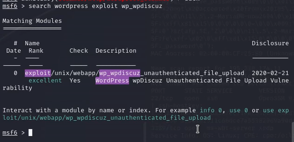{#fig:012}

С помощью команды options можно посмотреть доступные параметры для данного модуля (рис. @fig:013)

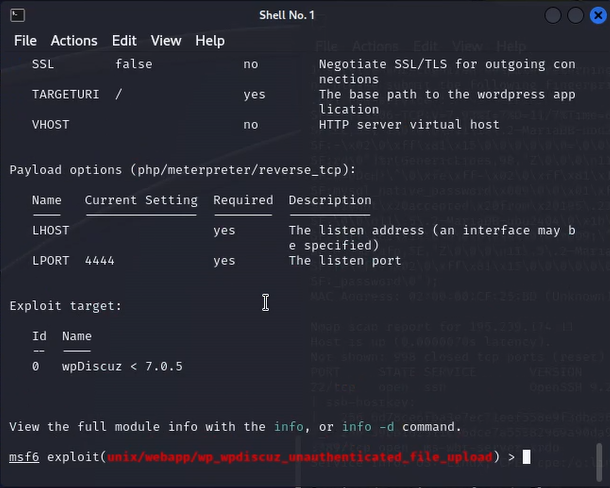{#fig:013}

Далее установить значения параметров для атаки (рис. @fig:014)

{#fig:014}

В результате запуска модуля будет получена meterpreter-сессия от имени пользователя "www-data" (рис. @fig:015)

{#fig:015}

### 2.1.2 Поиск DNS-сервера 

После получения сессии можно переходить к процедуре поиска нужного сервера. В первую очередь выполнить проброс портов во внутреннуюю сеть с помощью команды autoroute и запустить данную сеть - run autoroute -s 10.10.10.0/24. (рис. @fig:016)

{#fig:016}

Мне необходимо проверить наличие открытых портов на хостах, которые находятся во внутренней сети организации, с помощью модуля nmap. Поскольку сканируемые хосты находятся во внутренней сети, в первую очередь я настраиваю прокси, через который будут проходить все запросы при сканировании. Для этого я использую модуль metasploit auxiliary/server/socks_proxy.

Сворачиваю текущую сессию с помощью команды `bg`, затем нахожу и выбираю модуль metasploit auxiliary/server/socks_proxy. (рис. @fig:017)

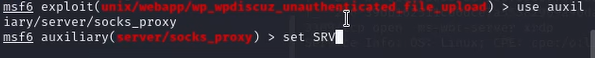{#fig:017}

Настраиваем и запускаем модуль (рис. @fig:018)

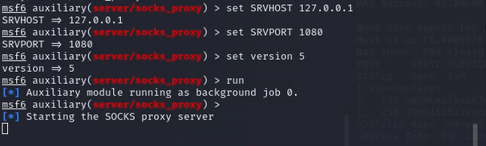{#fig:018}

Далее открываем новый терминал kali. В новом терминале запускаем сканирование 100 самых часто используемых портов с помощью команды proxychains nmap -n -sT -Pn --top-ports 100 10.10.10.15 (рис. @fig:019)

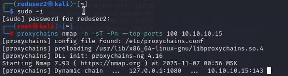{#fig:019}

По стандарту RFC 1035 все DNS-серверы отвечают на порту 53 TCP и UDP. По результатам сканирования я делаю вывод, что узел 10.10.10.15 является целью атаки - DNS-сервером с открытым 22 портом SSH. (рис. @fig:020)

{#fig:020}

### 2.2 Bruteforce пароля

В результате сканирования будет получен список открывтых портов, в котором обнаружен 22 порт, используемый  по умолчанию для подключения по протоколу SSH. Для реализации атаки перебором паролей использовать словарь rockyou.txt, который находится на пути /usr/share/wordlists (рис. @fig:021)

{#fig:021}

Логин пользователя я могу получить с помощью файла userlist в директории /usr/share/wordlists с именами пользователей. Выбираю пользователя «user», затем запускаю утилиту hydra с помощью команды:
proxychains hydra -V -f -l user -P rockyou.txt -t 32 10.10.10.15 ssh (рис. @fig:022)

{#fig:022}

Задаем set rhost 10.10.10.15, set username user, set password 'california101', run  (рис. @fig:023)

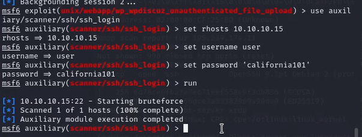{#fig:023}

Для получения доступа к DNS-серверу я могу воспользоваться подключением по SSH с полученными учетными данными или модулем metasploit auxiliary/scanner/ssh/ssh_login с указанием параметров для входа.
Подключение по SSH с полученными учетными данными осуществляется с помощью команды: proxychains ssh. 
После этого необходимо ввести найденный пароль. user@10.10.10.15 (рис. @fig:024)

{#fig:024}

Для получения флага необходимо вывести содержимое файла /etc/hosts с помощью команды cat /etc/hosts (рис. @fig:025)

{#fig:025}

# Вывод

Отработали навыки проведения комплексной кибератаки в контролируемой среде, имитирующей реальную корпоративную сеть.

# Список литературы{.unnumbered}

::: {#refs}
:::

