---
## Front matter
lang: ru-RU
title: Презентация по лабораторной работе №5
subtitle: ""
author:
  - Еюбоглу Тимур, Зиязетдинов Алмаз, Исаев Булат
institute:
  - Российский университет дружбы народов, Москва, Россия

## i18n babel
babel-lang: russian
babel-otherlangs: english

## Formatting pdf
toc: false
toc-title: Содержание
slide_level: 2
aspectratio: 169
section-titles: true
theme: metropolis
header-includes:
 - \metroset{progressbar=frametitle,sectionpage=progressbar,numbering=fraction}
 - '\makeatletter'
 - '\makeatother'
---

## Докладчик

  * Еюбоглу Тимур
  * 1032224357
  * уч. группа: НПИбд-01-22
  * Факультет физико-математических и естественных наук
  * Российский университет дружбы народов

## Цель лабораторной работы

Во внутреннем сегменте организации необходимо получить доступ к серверу базы данных (БД) и найти флаг в таблице БД «Flag»

# Выполнение лабораторной работы

## Разведка

{#fig:001}

## Адрес имеет открытый порт

{#fig:001}

## Сайт создан с помощью CMS Wordpress

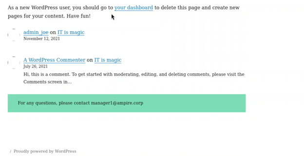{#fig:003}

## Открываем Metasploit

{#fig:004}

## Выбор подходящего модуля сканирования

{#fig:005}

## Наиболее подходящим под требуемые задачи

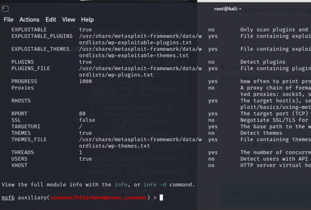{#fig:006}

## Задаем параметр rhost

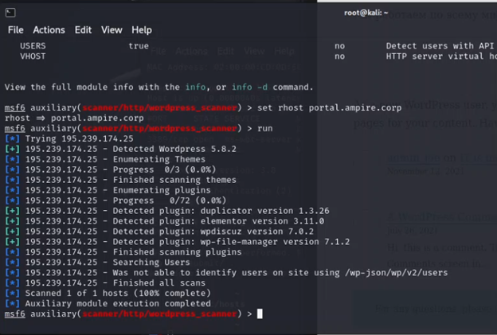{#fig:007}

## Адрес поста

{#fig:008}

## Выход из модуля и поиск exploit

{#fig:009}

## Выбранный модуль (use 0)

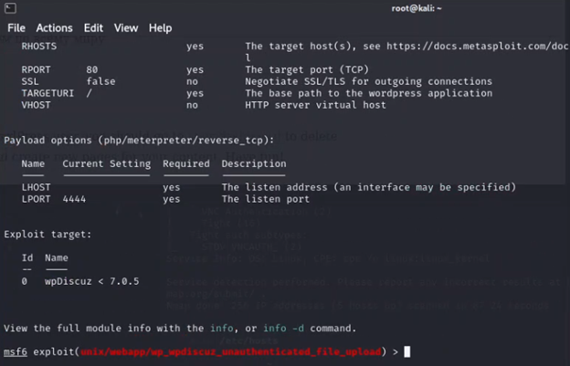{#fig:010}

## Установка значений параметров для атаки

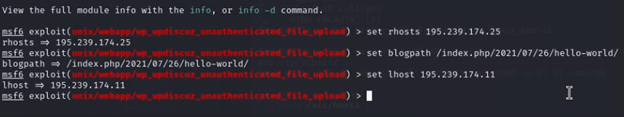{#fig:011}

## Получение meterpreter-сессии

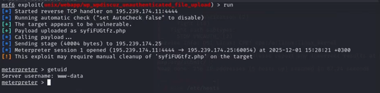{#fig:012}

## Параметры модуля

{#fig:013}

## Настройка и запуск meterpreter-сессии

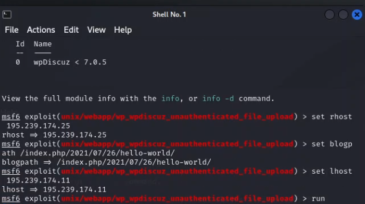{#fig:014}

## Перенаправление к сети маршрут

{#fig:015}

## Настройки модуля Multi Gather Ping Sweep

{#fig:016}

## Настройка и запуск модуля

{#fig:017}

## Результаты сканирования портов

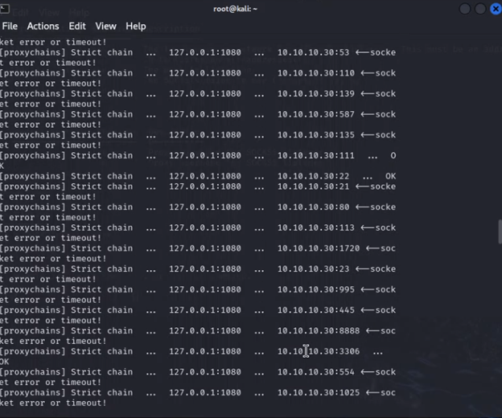{#fig:018}

## Результаты сканирования

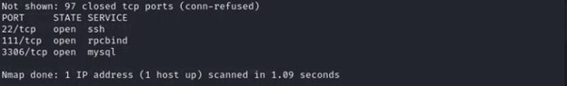{#fig:019}

## Bash-скрипт для перебора пароля

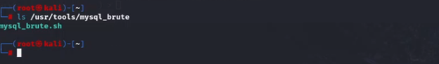{#fig:020}

## Список активных сессий

{#fig:021}

## Список активных сессий

{#fig:022}

## Загрузка файлов на машину

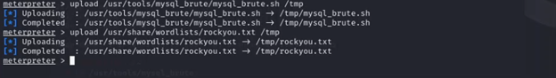{#fig:023}

## Просмотр загруженных файлов

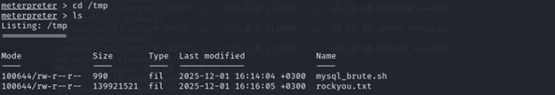{#fig:024}

## Запуск bash-скрипта для перебора пароля

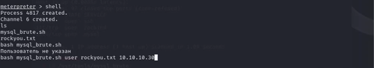{#fig:025}

## Подобранный пароль в результате атаки перебором

{#fig:026}

## Подключение к MySQL

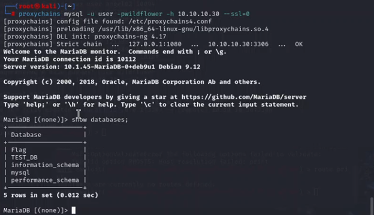{#fig:027}

## Получение флага

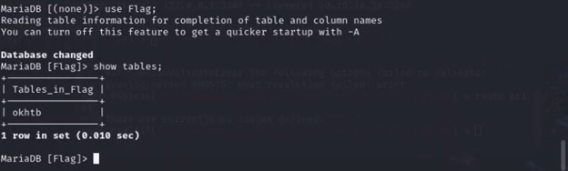{#fig:028}

# Вывод

## Вывод

Во внутреннем сегменте организации получили доступ к серверу базы данных (БД) и нашли флаг в таблице БД «Flag»

# Список литературы. Библиография

